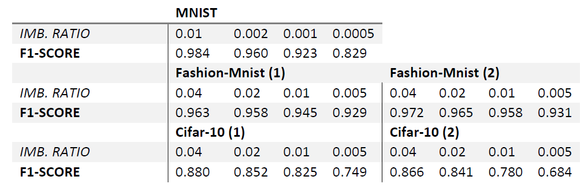

# imbDRL

 

***Imbalanced Classification with Deep Reinforcement Learning.***

This repository contains an (Double) Deep Q-Network implementation of binary classification on unbalanced datasets using [TensorFlow 2.3+](https://www.tensorflow.org/) and [TF Agents 0.6+](https://www.tensorflow.org/agents). The Double DQN as published in [this paper](https://arxiv.org/abs/1509.06461) by *van Hasselt et al. (2015)* is using a custom environment based on [this paper](https://arxiv.org/abs/1901.01379) by *Lin, Chen & Qi (2019)*.

Example scripts on the [Mnist](http://yann.lecun.com/exdb/mnist/), [Fashion Mnist](https://github.com/zalandoresearch/fashion-mnist), [Credit Card Fraud](https://www.kaggle.com/mlg-ulb/creditcardfraud) and [Titanic](https://www.tensorflow.org/datasets/catalog/titanic) datasets can be found in the `./imbDRL/examples/ddqn/` folder.

## Results

The following results are collected with the scripts in the appendix: [imbDRLAppendix](https://github.com/Denbergvanthijs/imbDRLAppendix). Experiments conducted on the latest release of *imbDRL* and based on [this paper](https://arxiv.org/abs/1901.01379) by *Lin, Chen & Qi (2019)*.



## Requirements

* [Python 3.7+](https://www.python.org/)
* The required packages as listed in: `requirements.txt`
* Logs are by default saved in `./logs/`
* Trained models are by default saved in `./models/`
* Optional: `./data/` folder located at the root of this repository.
  * This folder must contain ```creditcard.csv``` downloaded from [Kaggle](https://www.kaggle.com/mlg-ulb/creditcardfraud) if you would like to use the [Credit Card Fraud](https://www.kaggle.com/mlg-ulb/creditcardfraud) dataset.
  * Note: `creditcard.csv` needs to be split in a seperate train and test file. Please use the function `imbDRL.utils.split_csv`

## Getting started

Install via `pip`:

* `pip install imbDRL`

Run any of the following scripts:

* `python .\imbDRL\examples\ddqn\train_credit.py`
* `python .\imbDRL\examples\ddqn\train_famnist.py`
* `python .\imbDRL\examples\ddqn\train_mnist.py`
* `python .\imbDRL\examples\ddqn\train_titanic.py`

## TensorBoard

To enable [TensorBoard](https://www.tensorflow.org/tensorboard), run ```tensorboard --logdir logs```

## Tests and linting

Extra arguments are handled with the `./tox.ini` file.

* Pytest: `python -m pytest`
* Flake8: `flake8`
* Coverage can be found in the generated `./htmlcov` folder

## Appendix

The appendix can be found in the [imbDRLAppendix](https://github.com/Denbergvanthijs/imbDRLAppendix) repository.
